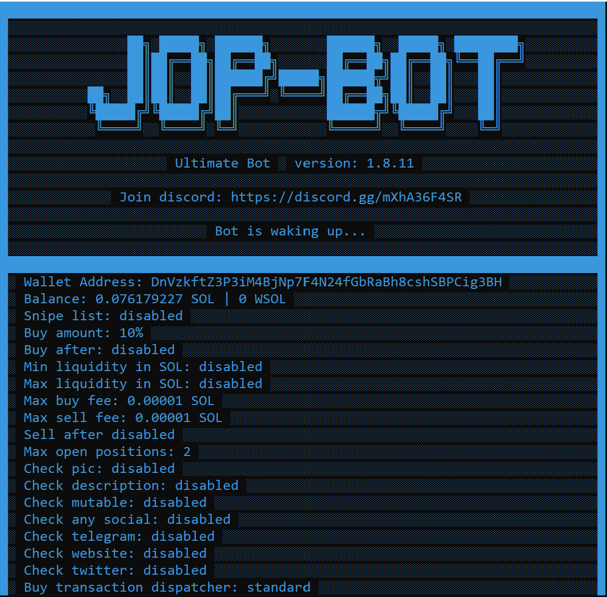

# JopBot CLI - Advanced Solana Trading Bot

## Overview

**JopBot** is a state-of-the-art **Solana trading bot** engineered for trading **memcoins**, **Raydium**, **Pumpfun**, and more. Designed to optimize your trading strategies, JopBot integrates advanced features such as **copy trading**, **scraping**, **sniffing**, **take profit**, **stop loss**, and **trailing stop loss** to ensure you stay ahead in the dynamic cryptocurrency market.

## Features

**JopBot CLI. Version 1.8+ Features:**

- **Copy Trading**: 
  - Multi-wallet support.
  - Smart copy-buy and smart copy-sell functionalities.
  
- **Telegram Sniffer (Scraping)**: 
  - Monitor Telegram channels for trading signals.
  
- **Discord Sniffer (Scraping)**: 
  - Track Discord channels to capture profitable trading opportunities.
  
- **Auto-Trading**: 
  - Automated take-profit and stop-loss strategies.
  - Scale out profits and limit losses with precision.
  
- **Manual Trading/Scalping**: 
  - Execute manual trades and scalping strategies directly from the interface.
  
- **Realtime Price Visualization**: 
  - Live charts and graphs to monitor market movements.
  
- **Telegram PnL Notifications**: 
  - Receive profit and loss updates via Telegram.
  
- **Raydium Sniping Support**: 
  - Specialized tools for sniping tokens on the Raydium exchange.
  
- **Pumpfun Tokens Support**: 
  - Comprehensive support for Pumpfun tokens, including migration sniping.
  
- **Sniping Pumpfun Tokens During Migration**: 
  - Enhanced sniping capabilities during token migration phases.
  
- **Jito Bundles Support with Dynamic Jito Fees**: 
  - Utilize Jito bundles with dynamically adjusting fees for optimized trading.
  
- **bloXroute Transactions Support**: 
  - Integration with bloXroute for faster and more efficient transactions.
  
- **Priority Fees**: 
  - Manage transaction priority fees efficiently.
  
- **Freezable/Mintable/Socials/Burnt/Top-Holder Checks**: 
  - Comprehensive checks to validate token integrity and holder distribution.
  
- **Anti-MEV Protection**: 
  - Safeguards against Miner Extractable Value (MEV) attacks.
  
- **gRPC Support (Copy-Trading)**: 
  - Enhanced copy-trading functionalities via gRPC support.
  
- **Separate GPA/RPC Calls**: 
  - Optimized handling of GPA and RPC calls for better performance.
  
- **Cross-Platform Compatibility**: 
  - Seamlessly operates on **Windows**, **Mac**, and **Linux** systems.

### Dashboard, Trading Interface, Real-time Price Visualization

## Why Choose JopBot?

- **Comprehensive Trading Tools**: From copy trading to manual scalping, JopBot offers a suite of tools tailored for every trader's needs.
- **Advanced Security Features**: With anti-MEV protection and thorough token checks, your investments are safeguarded.
- **Real-time Insights**: Stay informed with live price charts and instant PnL notifications.
- **Seamless Integration**: Supports major exchanges like Raydium and utilizes services like bloXroute for optimized performance.

## Join Our Community

Ready to elevate your trading game? [Join our Discord](https://discord.gg/kVMgcaD3NR) to connect with other traders, get support, and stay updated with the latest features and developments of JopBot!

## Keywords

Solana Trading Bot, memcoin, jito bundles, Raydium, Pumpfun, copy trading, scraping, sniffing, take profit, stop loss, trailing stop loss

---

## Contact

For more information, visit our [Discord](https://discord.gg/kVMgcaD3NR).
